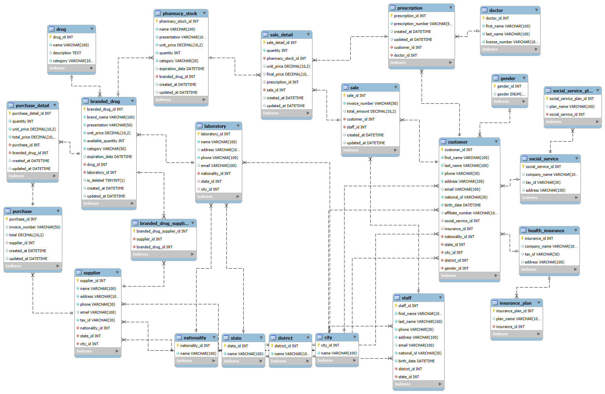

# Pharmacy Database Project

This repository contains the SQL scripts and resources for a pharmacy management database. The project includes schema definitions, seed data, views, and stored procedures for managing purchases, sales, inventory, and customer information.

## Stored Procedure Execution Examples

- [Purchase Process - `insert_purchase_detail`](./DatabaseExecutionExamples.md) - See how purchases are registered with automatic stock updates
- [Sales Process - `insert_sale_details`](./sp_insert_sale_details.md) - See how sales are processed with prescription validation and inventory deduction

## Folder Structure

All SQL files are located in the `sql/` folder:
- `schema.sql`: Database schema and table definitions.
- `seed.sql`: Initial data for tables (drugs, suppliers, customers, etc.).
- `views.sql`: SQL views for reporting and data aggregation.
- `insert_purchase_details.sql`: Stored procedures and functions for handling purchases.
- `insert_sale_details.sql`: Stored procedures and functions for handling sales.
- `EER-Diagram.png`: Entity-Relationship diagram of the database.
- `models.mwb`: MySQL Workbench model file.

## How to Set Up the Database

1. **Install MySQL Server**
   - Make sure you have MySQL installed on your system.

2. **Create the Database and Tables**
   - Open MySQL Workbench or your preferred SQL client.
   - Run the script `sql/schema.sql` to create the database and all tables.

3. **Insert Initial Data**
   - Run the script `sql/seed.sql` to populate the tables with initial data.

4. **Create Views**
   - Run the script `sql/views.sql` to create useful views for reporting and analysis.

5. **Add Stored Procedures and Functions**
   - Run `sql/insert_purchase_details.sql` and `sql/insert_sale_details.sql` to add stored procedures and functions for managing purchases and sales.

## Usage
- You can use the provided stored procedures to insert purchase and sale details efficiently.
- The views allow you to easily query and report on purchases, sales, inventory, and customer profiles.
- For detailed execution examples with screenshots, see the [Stored Procedure Execution Examples](#stored-procedure-execution-examples) section above.

## EER Diagram


## Assets
An `assets/` directory (e.g. `sql/assets/` or a top-level `assets/`) is intended for storing diagrams and future visual documentation (flow charts, sequence diagrams, etc.). Currently the diagram file is located at `sql/EER-Diagram.png`. If you prefer a cleaner structure you can move it to `sql/assets/EER-Diagram.png` and update the path above accordingly:

```markdown

```

Recommended naming for future images:
- `eer-diagram.png`
- `purchase-flow.png`
- `sale-procedure-sequence.png`

Keep images under ~1 MB for fast repository browsing.


## Notes
- All scripts are written for MySQL.
- Make sure to run the scripts in the order listed above for proper setup.
- For any issues or questions, refer to the comments in each SQL file.

