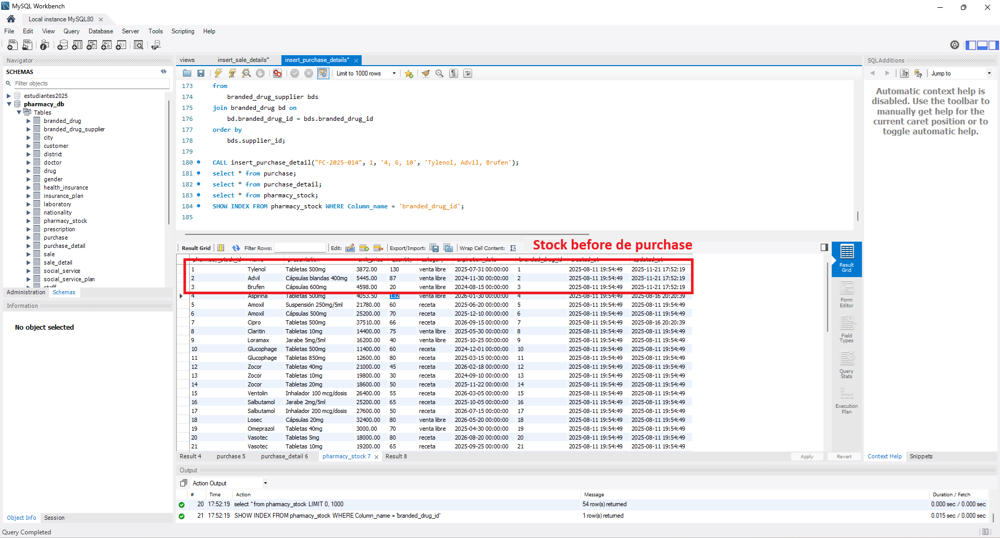
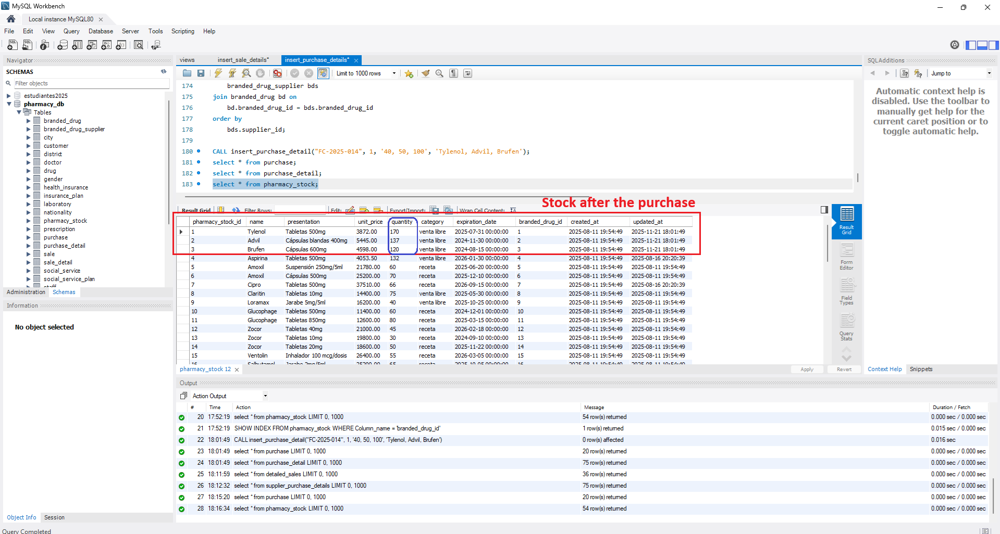
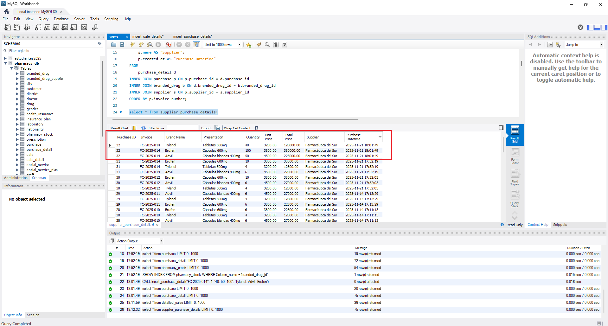

### Stored Procedure - `insert_purchase_detail`

This procedure demonstrates how a single call can orchestrate multiple database operations atomically: registering a purchase header, inserting line items, and updating pharmacy stock—all within one transaction.

#### Parameters

The procedure accepts only 4 simple parameters:

```sql
CALL insert_purchase_detail(
    i_invoice_number VARCHAR(50),  -- Supplier invoice number
    i_supplier_id INT,              -- Supplier ID
    i_quantity TEXT,                -- Comma-separated quantities: '40, 50, 100'
    i_names TEXT                    -- Comma-separated drug names: 'Tylenol, Advil, Brufen'
);
```

With just these 4 inputs, the procedure performs complex multi-table operations automatically.

---

#### Step 1: Initial State - Stock Before Purchase

Before executing the purchase, let's examine the current pharmacy stock. The screenshot below shows the initial quantities for the drugs we're about to purchase:



**What we see:**
- **Tylenol**: Currently has 130 units in stock at $872.00 per unit
- **Advil**: Currently has 87 units in stock at $445.00 per unit  
- **Brufen**: Currently has 120 units in stock at $698.00 per unit

These quantities will be updated after the purchase is processed.

---

#### Step 2: Executing the Procedure

Now we execute the stored procedure with our purchase data:

```sql
CALL insert_purchase_detail(
    'FC-2025-014',           -- Invoice number
    1,                       -- Supplier ID (Farmacéutica del Sur)
    '40, 50, 100',          -- Quantities to purchase
    'Tylenol, Advil, Brufen' -- Drug names
);
```


**What happens internally:**

1. **Validation Phase**
   - Checks that supplier ID 1 exists
   - Verifies drug names are unique in `branded_drug` table
   - Confirms supplier provides each drug via `branded_drug_supplier` relationship

2. **Transaction Begins**
   - Creates a new record in `purchase` table with invoice 'FC-2025-014'
   - Initially sets `total = 0` (will calculate later)
   - Captures the new `purchase_id`

3. **Parsing Loop** (iterates 3 times for our 3 drugs)
   - Extracts first name ('Tylenol') and quantity (40) from comma-separated lists
   - Looks up drug details: unit price, presentation, category, expiration
   - Calculates line total: `40 × $3200 = $128,000`
   - Inserts row into `purchase_detail`
   - Repeats for 'Advil' and 'Brufen'

---

#### Step 3: Purchase Detail Records Created

After processing all three drugs, we can see the detailed line items in `purchase_detail`:


**What this shows:**
- **3 new rows** inserted into `purchase_detail` table
- Each row links to the same `purchase_id` (32 in this example)
- **Quantities**: 40, 50, 100 (as specified in our input)
- **Unit prices**: Retrieved from `branded_drug` table for each drug
- **Total prices**: Calculated per line (quantity × unit_price)
- **Branded_drug_id**: Foreign keys linking to specific drugs

The procedure automatically calculated:
- Line 1: 40 × $3,200 = $128,000 (Tylenol)
- Line 2: 50 × $4,500 = $225,000 (Advil)
- Line 3: 100 × $3,800 = $380,000 (Brufen)

---

#### Step 4: Stock Updated Automatically

While inserting purchase details, the procedure **simultaneously updates** `pharmacy_stock` using `ON DUPLICATE KEY UPDATE`:



**What changed:**
- **Tylenol**: 130 → **170 units** (+40 purchased)
- **Advil**: 87 → **137 units** (+50 purchased)
- **Brufen**: 120 → **220 units** (+100 purchased)

**How it works:**
```sql
INSERT INTO pharmacy_stock (name, presentation, unit_price, quantity, ...) 
VALUES (...)
ON DUPLICATE KEY UPDATE 
    quantity = pharmacy_stock.quantity + new.quantity,
    unit_price = new.unit_price,
    ...
```

Since `pharmacy_stock` has a UNIQUE constraint on `branded_drug_id`, if the drug already exists, the quantities **accumulate** instead of creating duplicates. The procedure also applies a **21% tax markup** for retail pricing:

```sql
final_price_wtaxes = unit_price + (unit_price * 0.21)
```

So wholesale prices from suppliers are marked up for pharmacy sales.

---

#### Step 5: Final Purchase Summary

The procedure completes by calculating the total and updating the purchase header:



**Final result in `purchase` table:**
- **Invoice**: FC-2025-014
- **Total**: $733,000 (sum of all line totals: $128,000 + $225,000 + $380,000)
- **Supplier**: Farmacéutica del Sur (ID: 1)
- **Timestamp**: Automatically recorded

This is done by calling the helper function:
```sql
SET total_purchase = calculate_total_purchase(v_purchase_id);
UPDATE purchase SET total = total_purchase WHERE purchase_id = v_purchase_id;
```

The view `supplier_purchase_details` (shown in screenshot) joins all related tables to display:
- Purchase ID and invoice number
- Brand names and presentations
- Quantities and prices per line
- Supplier name
- Purchase datetime

---

#### Why This Design is Powerful

**Single Atomic Operation:**
- One procedure call updates **3 different tables** (`purchase`, `purchase_detail`, `pharmacy_stock`)
- If ANY step fails (e.g., invalid drug name), **everything rolls back**—no partial data

**Transaction Safety:**
```sql
DECLARE EXIT HANDLER FOR SQLEXCEPTION
BEGIN
    ROLLBACK;
    RESIGNAL;
END;
```

**Automatic Calculations:**
- Line totals computed from quantity × price
- Purchase total aggregated from all lines
- Stock quantities accumulated (old + new)
- Tax markup applied for retail pricing

**Data Integrity Enforced:**
- Validates supplier exists
- Checks drug names are unambiguous (no duplicates)
- Verifies supplier-drug relationship via `branded_drug_supplier`
- Ensures matching list lengths (quantities ↔ names)

---

#### Complete Example Query Sequence

```sql
-- 1. Check stock before
SELECT name, quantity, unit_price FROM pharmacy_stock 
WHERE name IN ('Tylenol', 'Advil', 'Brufen');

-- 2. Execute purchase
CALL insert_purchase_detail(
    'FC-2025-014', 
    1, 
    '40, 50, 100', 
    'Tylenol, Advil, Brufen'
);

-- 3. View purchase header
SELECT * FROM purchase WHERE invoice_number = 'FC-2025-014';

-- 4. View line items
SELECT * FROM purchase_detail 
WHERE purchase_id = (SELECT purchase_id FROM purchase WHERE invoice_number = 'FC-2025-014');

-- 5. Check stock after
SELECT name, quantity, unit_price FROM pharmacy_stock 
WHERE name IN ('Tylenol', 'Advil', 'Brufen');

-- 6. View complete purchase report (using view)
SELECT * FROM supplier_purchase_details 
WHERE Invoice = 'FC-2025-014';
```

---

#### Technical Highlights

**String Parsing Technique:**
The procedure uses `SUBSTRING_INDEX` to split comma-separated lists:
```sql
SET name = TRIM(SUBSTRING_INDEX(TRIM(i_names), ',', 1));
SET i_names = TRIM(SUBSTRING(i_names, CHAR_LENGTH(name) + 2));
```

This iteratively extracts and removes elements from the TEXT parameters.

**Upsert Pattern:**
The `ON DUPLICATE KEY UPDATE` clause elegantly handles both scenarios:
- **Drug not in stock** → INSERT new row
- **Drug already in stock** → UPDATE quantity (add to existing)

**Function Reusability:**
Total calculation is separated into `calculate_total_purchase()` function, making it:
- Testable independently
- Reusable (e.g., for recalculating totals after corrections)
- Clearer to read

---
