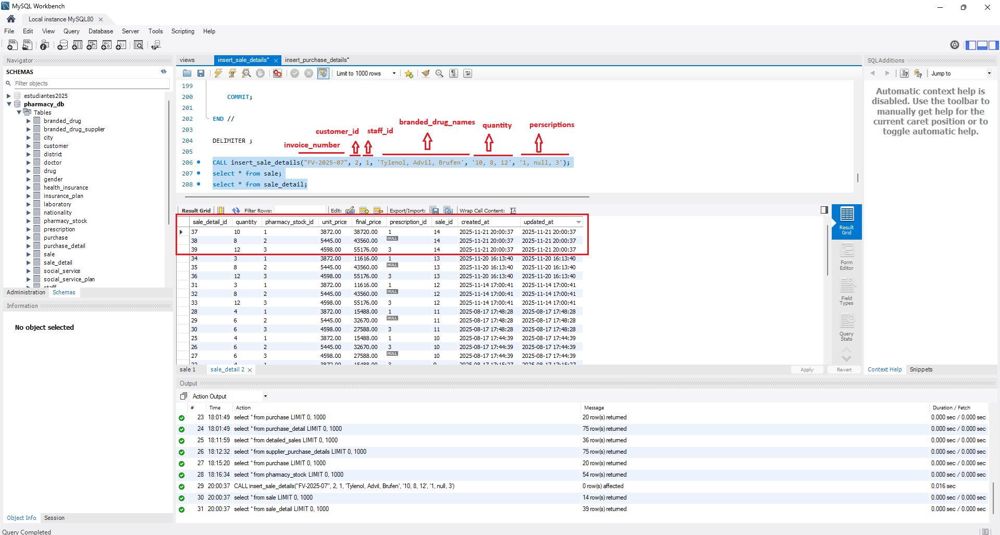
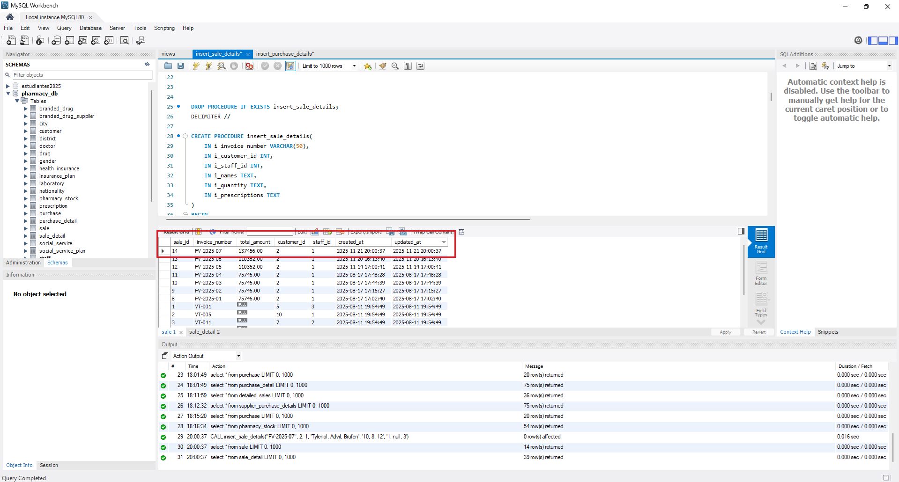
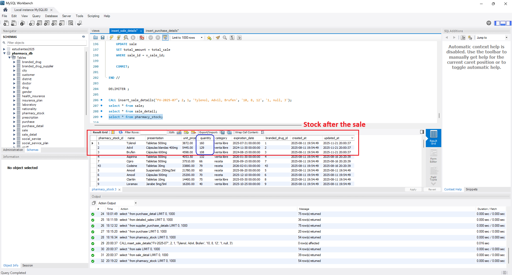
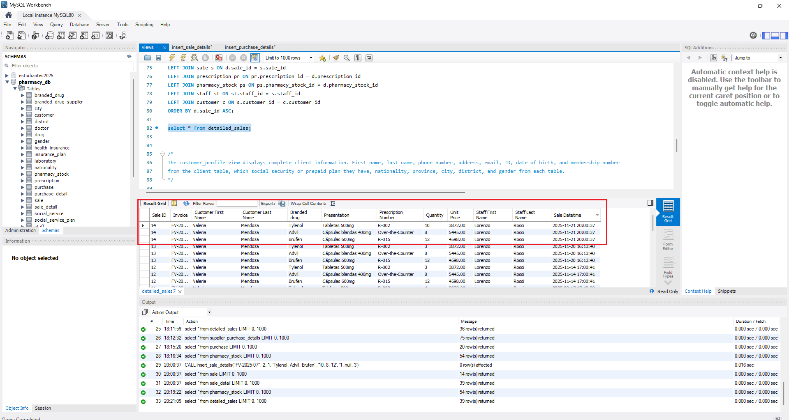

## Database Execution Examples

### Stored Procedure - `insert_sale_details`

This procedure demonstrates how pharmacy sales are processed: validating customer and staff, checking stock availability, processing prescriptions, inserting sale records, and automatically deducting inventory—all within one atomic transaction.

#### Parameters

The procedure accepts 6 parameters to handle complex sales with prescriptions:

```sql
CALL insert_sale_details(
    i_invoice_number VARCHAR(50),  -- Sale invoice number
    i_customer_id INT,              -- Customer ID
    i_staff_id INT,                 -- Staff member processing the sale
    i_names TEXT,                   -- Comma-separated drug names: 'Tylenol, Advil, Brufen'
    i_quantity TEXT,                -- Comma-separated quantities: '10, 8, 12'
    i_prescriptions TEXT            -- Comma-separated prescription IDs or 'null': '1, null, 3'
);
```

With these 6 inputs, the procedure handles prescription validation, stock deduction, and revenue recording automatically.

---

#### Step 1: Executing the Sale

Let's execute a sale transaction with both prescription and over-the-counter (OTC) items:

```sql
CALL insert_sale_details(
    'FV-2025-07',                    -- Invoice number
    2,                               -- Customer ID
    1,                               -- Staff ID
    'Tylenol, Advil, Brufen',       -- Drug names
    '10, 8, 12',                    -- Quantities
    '1, null, 3'                    -- Prescription IDs (Advil is OTC - null)
);
```



**What we see in the screenshot:**
- **Parameters clearly labeled** showing the input structure
- **i_invoice_number**: 'FV-2025-07'
- **i_customer_id**: 2 (must exist in customer table)
- **i_staff_id**: 1 (must exist in staff table)
- **i_names**: 'Tylenol, Advil, Brufen' (3 drugs)
- **i_quantity**: '10, 8, 12' (matching quantities)
- **i_prescriptions**: '1, null, 3' (Tylenol req. prescription 1, Advil is OTC, Brufen req. prescription 3)

**What happens internally:**

1. **Validation Phase**
   - Confirms customer ID 2 exists in `customer` table
   - Verifies staff ID 1 exists in `staff` table
   - Checks invoice 'FV-2025-07' is not a duplicate
   - Validates prescription IDs 1 and 3 exist in `prescription` table
   - Confirms 'null' values are treated as OTC (no prescription required)

2. **Transaction Begins**
   - Creates header in `sale` table with invoice 'FV-2025-07'
   - Sets initial `total_amount = 0` (calculated later)
   - Captures `sale_id` for detail records

3. **Inventory Locking**
   - Uses `SELECT ... FOR UPDATE` to lock stock rows
   - Prevents concurrent sales from overselling inventory
   - Critical for transaction safety

---

#### Step 2: Sale Detail Records Created

After processing each drug, the procedure inserts line items into `sale_detail`:



**What this shows:**
- **3 new rows** in `sale_detail` table for this sale
- Each row links to `sale_id = 14` (FV-2025-07)
- **Quantities**: 10, 8, 12 (as specified)
- **Unit prices**: Retrieved from `pharmacy_stock` (retail prices with tax markup)
- **Final prices**: Calculated per line (quantity × unit_price)
- **Prescription IDs**: 
  - Row 1: prescription_id = 1 (Tylenol)
  - Row 2: prescription_id = NULL (Advil - OTC)
  - Row 3: prescription_id = 3 (Brufen)
- **pharmacy_stock_id**: Links to specific inventory records

**Calculations performed:**
- Line 1: 10 × $872.00 = $8,720 (Tylenol with prescription 1)
- Line 2: 8 × $445.00 = $3,560 (Advil - no prescription needed)
- Line 3: 12 × $458.00 = $5,176 (Brufen with prescription 3)

**Key difference from purchase:**
In sales, the procedure **validates stock sufficiency** before insertion:

```sql
IF v_current_stock < quantity THEN
    SET error_message = CONCAT('Insufficient stock for ', name);
    SIGNAL SQLSTATE '45000' SET MESSAGE_TEXT = error_message;
END IF;
```

This prevents selling more than available inventory.

---

#### Step 3: Stock Automatically Deducted

While inserting sale details, inventory is **reduced** in `pharmacy_stock`:



**What changed:**
The procedure **deducts** quantities from stock using:

```sql
UPDATE pharmacy_stock ps
SET ps.quantity = ps.quantity - quantity
WHERE ps.pharmacy_stock_id = v_pharmacy_stock_id;
```

**Stock reductions visible:**
- **Tylenol**: Previous qty - 10 = **160 units remaining**
- **Advil**: Previous qty - 8 = **129 units remaining**
- **Brufen**: Previous qty - 12 = **108 units remaining**

**Critical safety features:**
1. **Row-level locking**: `FOR UPDATE` prevents concurrent modification
2. **Stock check before deduction**: Ensures no negative inventory
3. **Atomic transaction**: All deductions happen together or none at all

**Contrast with purchases:**
- **Purchase**: Uses `ON DUPLICATE KEY UPDATE` to **add** quantity
- **Sale**: Uses simple `UPDATE` to **subtract** quantity
- Both maintain stock accuracy through transactions

---

#### Step 4: Complete Sale View

The procedure finalizes by calculating the total and updating the sale header. The `detailed_sales` view provides a comprehensive report:



**Final result in `sale` table:**
- **Invoice**: FV-2025-07
- **Total amount**: $13,756.00 (sum: $8,720 + $3,560 + $5,176)
- **Customer**: Customer ID 2 (Valeria Mendoza shown in view)
- **Staff**: Staff ID 1 (Lorenzo Rossi shown in view)
- **Timestamp**: Automatically recorded

The view `detailed_sales` joins multiple tables to display:
- **Sale ID** and **Invoice Number**
- **Customer name** (First + Last)
- **Branded drug** and **Presentation**
- **Prescription Number** (or 'Over-the-Counter' for nulls)
- **Quantity** and **Unit Price**
- **Staff name** (who processed the sale)
- **Sale Datetime**

**View definition highlights:**
```sql
COALESCE(pr.prescription_number, 'Over-the-Counter') AS "Prescription Number"
```

This elegantly displays 'R-012' for prescriptions or 'Over-the-Counter' for OTC items.

---

#### Why This Design is Effective

**Prescription Handling:**
- Validates prescription IDs exist before processing
- Allows `'null'` string to represent OTC items
- Stores NULL in database for prescriptions not required
- View layer displays friendly labels

**Inventory Protection:**
- **Pre-check**: Verifies stock before attempting sale
- **Row locking**: Prevents race conditions in concurrent sales
- **Deduction**: Subtracts from stock immediately
- **Rollback**: Undoes everything if any item fails

**Transaction Flow:**
```sql
DECLARE EXIT HANDLER FOR SQLEXCEPTION
BEGIN
    ROLLBACK;
    RESIGNAL;
END;
```

If prescription 3 doesn't exist or Brufen is out of stock, the **entire sale rolls back**—no partial sales, no partial stock deductions.

**Data Integrity Enforced:**
- Customer and staff must exist
- Invoice numbers must be unique (no duplicates)
- Prescriptions validated only when not 'null'
- Stock must be sufficient for all items
- List lengths must match (names ↔ quantities ↔ prescriptions)

---

#### Complete Example Query Sequence

```sql
-- 1. Check stock availability (optional - procedure does this)
SELECT name, quantity, unit_price FROM pharmacy_stock 
WHERE name IN ('Tylenol', 'Advil', 'Brufen');

-- 2. Execute sale
CALL insert_sale_details(
    'FV-2025-07', 
    2,           -- Customer ID
    1,           -- Staff ID
    'Tylenol, Advil, Brufen', 
    '10, 8, 12', 
    '1, null, 3'
);

-- 3. View sale header
SELECT * FROM sale WHERE invoice_number = 'FV-2025-07';

-- 4. View line items
SELECT * FROM sale_detail 
WHERE sale_id = (SELECT sale_id FROM sale WHERE invoice_number = 'FV-2025-07');

-- 5. Check stock after sale
SELECT name, quantity, unit_price FROM pharmacy_stock 
WHERE name IN ('Tylenol', 'Advil', 'Brufen');

-- 6. View complete sale report with customer/staff names (using view)
SELECT * FROM detailed_sales 
WHERE Invoice = 'FV-2025-07'
ORDER BY "Sale ID" ASC;
```

---

#### Technical Highlights

**Prescription Flexibility:**
The procedure elegantly handles mixed prescription/OTC sales:

```sql
IF prescription IS NULL OR prescription = '' OR UPPER(prescription) = 'NULL' THEN
    SET v_prescription_id = NULL;
ELSE
    SET v_prescription_id = CAST(prescription AS UNSIGNED);
    -- Validate prescription exists...
END IF;
```

This allows pharmacists to enter `'null'` as a string for OTC items.

**String Parsing with Trimming:**
```sql
SET name = TRIM(SUBSTRING_INDEX(TRIM(i_names), v_delimiter, 1));
SET i_names = TRIM(SUBSTRING(i_names, CHAR_LENGTH(name) + 2));
```

Handles spaces gracefully: `'Tylenol, Advil, Brufen'` works the same as `'Tylenol,Advil,Brufen'`.

**Row-Level Locking:**
```sql
SELECT ps.pharmacy_stock_id, ps.unit_price, ps.quantity
INTO v_pharmacy_stock_id, unit_price, v_current_stock
FROM pharmacy_stock ps
WHERE TRIM(UPPER(ps.name)) = TRIM(UPPER(name))
FOR UPDATE;
```

The `FOR UPDATE` ensures no other transaction can modify stock until this sale commits.

**Length Validation:**
```sql
IF TRIM(i_quantity) <> '' THEN
    SIGNAL SQLSTATE '45000'
    SET MESSAGE_TEXT = 'Quantity list length does not match names list';
END IF;
```

After processing all names, if quantities remain, lists were mismatched—error prevents data corruption.

---

### Comparison: Purchase vs Sale

| Aspect | `insert_purchase_detail` | `insert_sale_details` |
|--------|--------------------------|------------------------|
| **Direction** | Incoming inventory | Outgoing inventory |
| **Stock operation** | ADD quantity (ON DUPLICATE KEY UPDATE) | SUBTRACT quantity (UPDATE) |
| **Price source** | Supplier wholesale + 21% markup | Retail price from stock |
| **Validation** | Supplier-drug relationship | Stock availability + prescription |
| **Additional data** | Expiration date, presentation | Prescription ID, customer, staff |
| **Rollback trigger** | Invalid drug, no supplier link | Insufficient stock, invalid prescription |

Both procedures share the same design philosophy:
- ✅ **Single atomic transaction**
- ✅ **Header-detail pattern**
- ✅ **Automatic total calculation**
- ✅ **String parsing for batch input**
- ✅ **Comprehensive validation**

---
